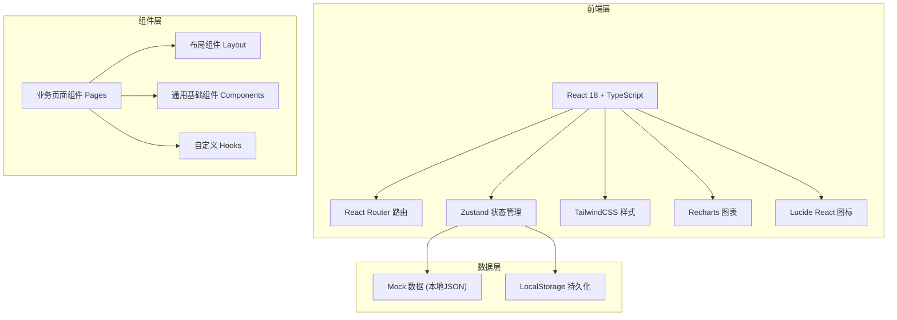
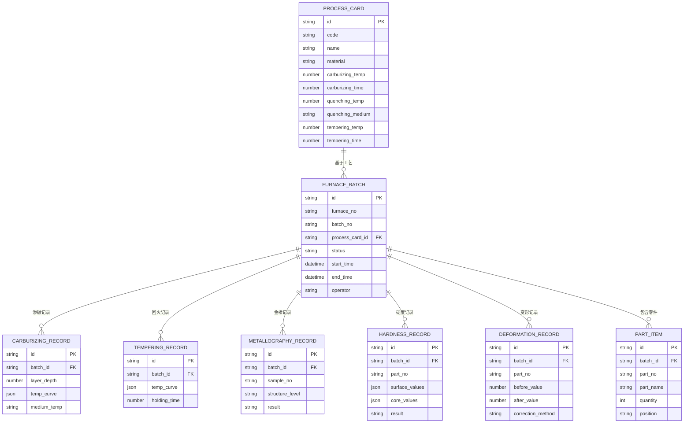

## 1. 架构设计



## 2. 技术描述

- **前端框架**: React 18 + TypeScript
- **构建工具**: Vite 5
- **路由管理**: React Router DOM v6
- **状态管理**: Zustand
- **UI样式**: TailwindCSS 3
- **图表库**: Recharts
- **图标库**: Lucide React
- **日期处理**: date-fns
- **后端**: 无后端，纯前端 Mock 数据
- **数据持久化**: LocalStorage

## 3. 路由定义

| 路由 | 页面 | 用途 |
|------|------|------|
| /dashboard | 仪表板 | 生产概览、统计数据 |
| /process-cards | 工艺卡片列表 | 工艺卡片管理 |
| /process-cards/new | 新增工艺卡片 |
| /process-cards/:id | 工艺卡片详情/编辑 |
| /furnace-planning | 装炉排产 | 装炉排产管理 |
| /carburizing | 渗碳淬火 | 渗碳淬火记录 |
| /tempering | 回火处理 | 回火处理记录 |
| /metallography | 金相检测 | 金相检测记录 |
| /hardness | 硬度检验 | 硬度检验记录 |
| /deformation | 变形矫正 | 变形矫正记录 |
| /traceability | 质量追溯 | 炉次追溯查询 |

## 4. 数据模型

### 4.1 实体关系图



## 5. 项目目录结构

```
src/
├── components/          # 通用组件
│   ├── Layout/        # 布局组件
│   │   ├── Sidebar.tsx
│   │   ├── Header.tsx
│   │   └── index.tsx
│   ├── ui/           # 基础UI组件
│   │   ├── Button.tsx
│   │   ├── Card.tsx
│   │   ├── Table.tsx
│   │   ├── Modal.tsx
│   │   ├── Form.tsx
│   │   └── Chart.tsx
│   └── common/       # 业务通用组件
├── pages/             # 页面组件
│   ├── Dashboard.tsx
│   ├── ProcessCards/
│   ├── FurnacePlanning/
│   ├── Carburizing/
│   ├── Tempering/
│   ├── Metallography/
│   ├── Hardness/
│   ├── Deformation/
│   └── Traceability/
├── store/             # Zustand状态管理
│   └── index.ts
├── data/              # Mock数据
│   └── mockData.ts
├── types/             # TypeScript类型定义
│   └── index.ts
├── utils/             # 工具函数
│   └── index.ts
├── App.tsx
├── main.tsx
└── index.css
```
